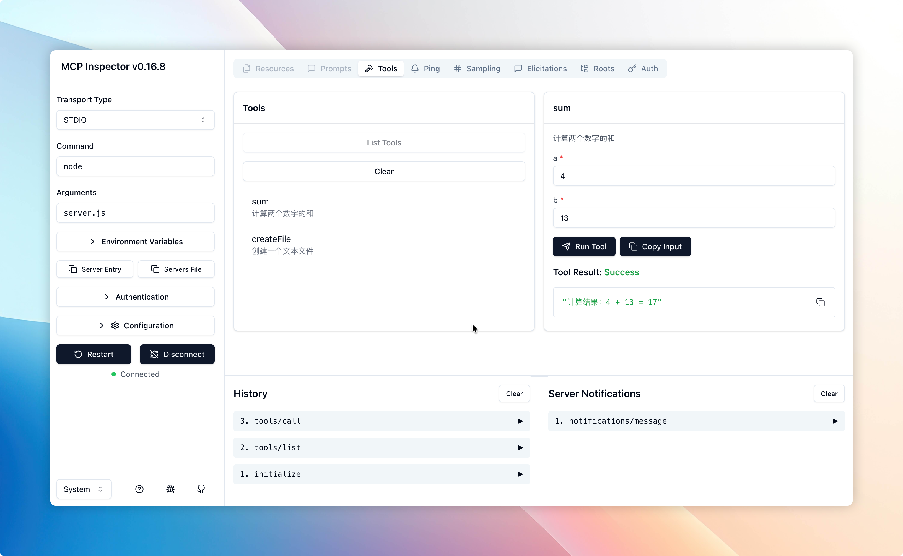

# MCP Demo

这是一个 MCP (Model Context Protocol) 服务器的基础实现，严格遵循 MCP 协议规范，展示了标准的 MCP 服务器功能。

## Getting start
```bash
cd mcp-demo
npm install
node server.js
```
服务器启动后会监听标准输入，等待 MCP 协议消息。

您可以在终端输入 `test-data.txt` 所提供的请求消息体进行测试。也可以通过 [mcp inspector](https://modelcontextprotocol.io/docs/tools/inspector) 进行连接。
```bash
npx @modelcontextprotocol/inspector
```



## 功能特性

### 核心 MCP 功能
- 基于 JSON-RPC 2.0 协议的 stdio 通信
- 标准 MCP 协议实现
  - MCP 协议初始化 (`initialize`)
  - 初始化完成通知 (`notifications/initialized`)
  - 工具列表获取 (`tools/list`)
  - 工具调用执行 (`tools/call`)
  - 服务关停 (`shutdown`)

### 提供的工具

#### 1. sum - 两数求和
计算两个数字的和并返回格式化结果

**参数：**
- `a` (number): 第一个数字
- `b` (number): 第二个数字

**返回：** 格式化的计算结果字符串

#### 2. createFile - 创建文件
创建一个文本文件并写入内容（异步操作）

**参数：**
- `filename` (string): 文件名（如：note.txt）
- `content` (string): 文件内容

**返回：** 文件创建结果信息


